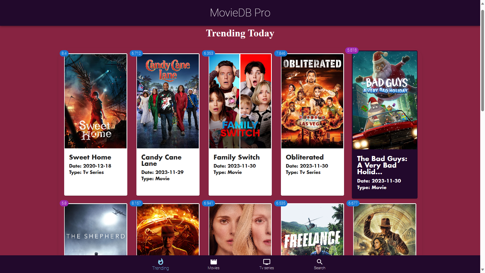
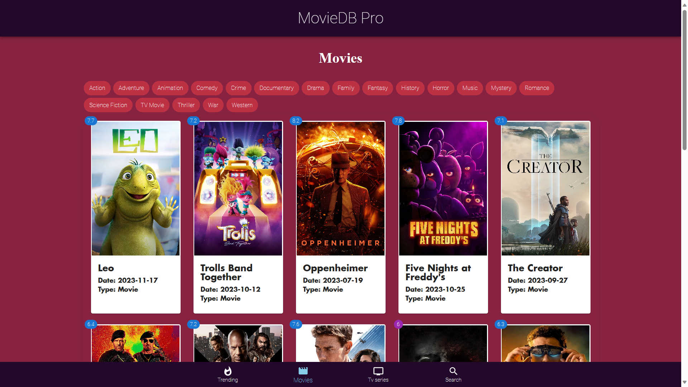
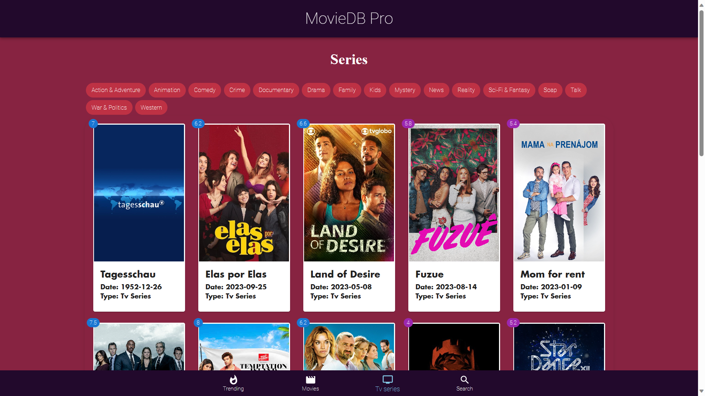
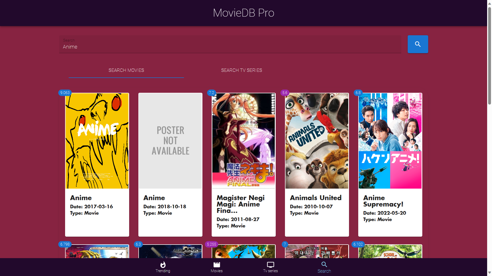

# MovieDB React App






This is a MovieDB web application built using React and Vite.

## Overview

This web app allows users to browse movies and TV series, view details, watch trailers, and discover trending content from The Movie Database (TMDb) API.

## Features

- Browse movies and TV series
- View details including poster images, release dates, and descriptions
- Watch trailers of movies and TV series
- Discover trending content
- Responsive design for various devices

## Technologies Used

- React
- Vite
- Axios for API requests
- Material-UI for UI components
- TMDb API for movie and TV series data

## Getting Started

### Installation

1. Clone this repository:

   ```bash
   git clone <repository-url>

   ```

2. Navigate to the project directory:

   ```bash
   cd MovieDB-React-App
   ```

3. Install dependencies:

   ```bash
   npm install
   ```

## Usage

1. Start the development server:
   ```bash
   npm run dev
   ```

This will start the development server. Open your browser and go to http://localhost:5173 to view the app.

## API Key

To utilize the TMDb API, acquire an API key and add it to the `.env` file:

```makefile
VITE_API_KEY=your-tmdb-api-key

```

## Acknowledgements

This MovieDB React App was developed with the invaluable guidance and knowledge gained from a YouTube tutorial created by [RoadsideCoder](https://youtu.be/vxUfx4aM5d8?si=H0UolCKMk4VW4MGP).
